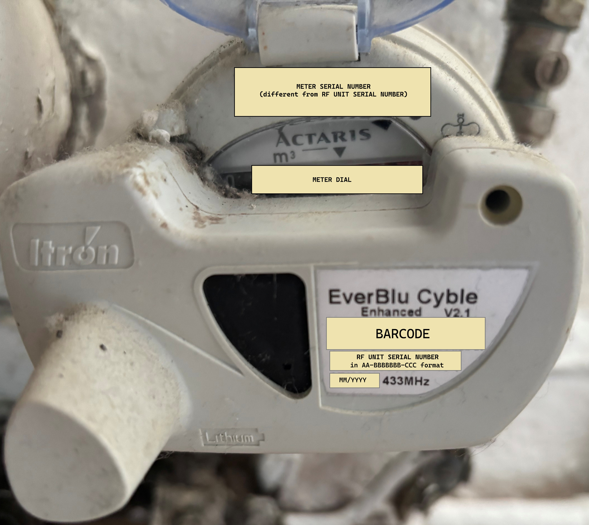
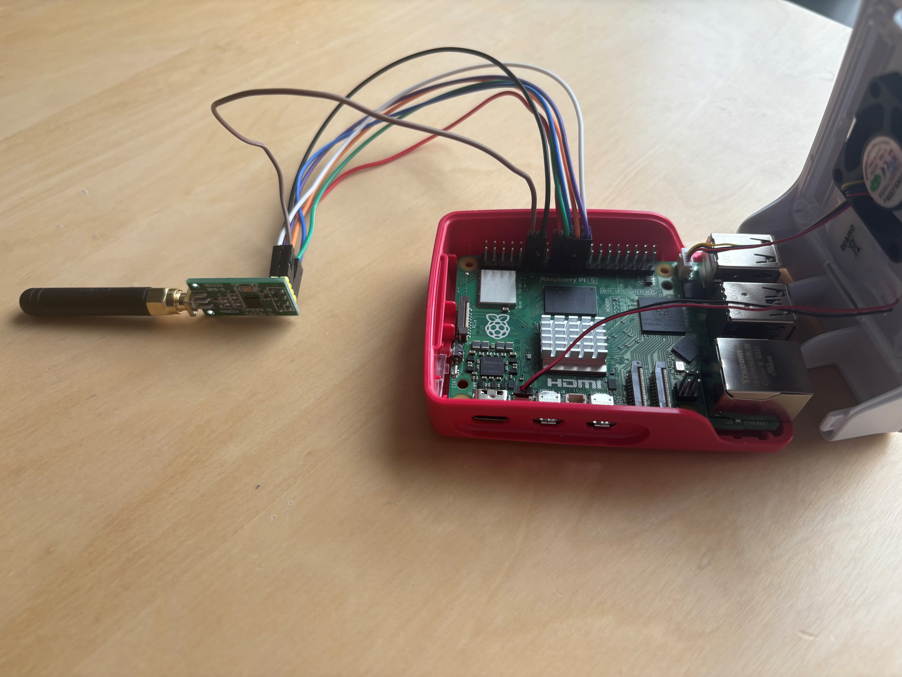
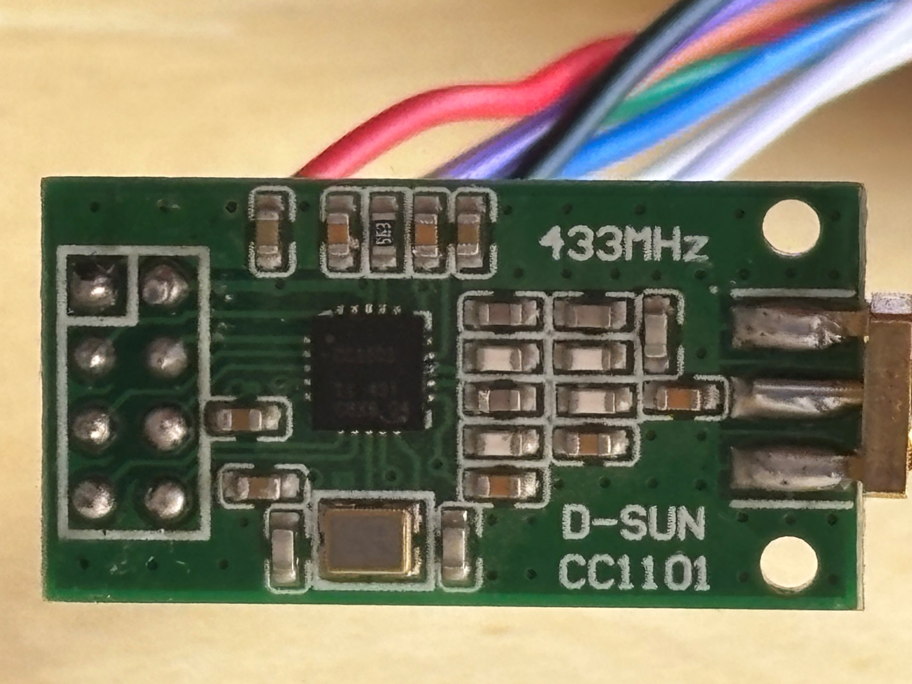

# EverBlu Cyble Water Meter Reader

Python implementation for reading an **Itron EverBlu Cyble Enhanced V2.1** water
meter over 433 MHz using a **Raspberry Pi 5** and a **CC1101** SPI
transceiver. Ports the field-tested C project
[`neutrinus/everblu-meters`](https://github.com/neutrinus/everblu-meters) to
native Python 3 and adds a wiring/health diagnostic suite.

> The meter uses the proprietary **Radian** protocol (2-FSK on 433.82 MHz). It
> only wakes to listen on **weekdays, typically 06:00–18:00**. Outside the
> window the meter will not respond — this is expected, not a bug.

## Hardware

### Water meter



### Raspberry Pi & CC1101 module



### CC1101 module



### Wiring (Pi header pin → CC1101 pin):

| Pi header | BCM       | CC1101 pin |
| --------- | --------- | ---------- |
| Pin 1     | 3V3       | VCC        |
| Pin 6     | GND       | GND        |
| Pin 11    | GPIO17    | GDO0       |
| Pin 13    | GPIO27    | GDO2       |
| Pin 19    | MOSI      | MOSI       |
| Pin 21    | MISO      | MISO       |
| Pin 23    | SCLK      | SCK        |
| Pin 24    | CE0       | CSN        |

Enable SPI on the Pi: `sudo raspi-config` → *Interface Options* → *SPI* → enable. Reboot.

## Install

```bash
python3 -m venv .venv
source .venv/bin/activate
pip install -r requirements.txt
```

`lgpio` is required (not `RPi.GPIO`, which does not work on the Pi 5).

## Diagnostics (run this first)

Verify the board is wired correctly and the CC1101 is alive **before**
trying to talk to the meter:

```bash
sudo ./.venv/bin/python scripts/diag.py
```

Checks performed:

1. **PARTNUM / VERSION** — expects `PARTNUM=0x00`, `VERSION ∈ {0x04, 0x14, 0x17}`.
   A hint is printed for common failure modes (all-zero = MISO floating,
   all-ones = CSN/SCK/power issue).
2. **PATABLE write/read-back** — validates burst SPI.
3. **Strobe/MARCSTATE** — confirms the chip transitions IDLE → RX → IDLE.
4. **Frequency register programming** — writes 433.82 MHz, reads back, verifies.
5. **GDO0/GDO2 wiring** — drives each GDO pin to hardware 0/1 via the CC1101
   `IOCFG` register and checks the Pi reads the correct level. Proves both
   pins are connected to the right GPIO.
6. **XOSC/192 clock on GDO0** — routes the ~135 kHz divided clock to GDO0;
   any non-trivial edge count confirms the crystal is running.
7. **RX noise floor (RSSI)** — puts the radio into RX, reports min/avg/max
   RSSI. Values typically in the `-90…-110 dBm` range mean the antenna/front
   end is alive.
8. **Config register dump** — full 47-byte register snapshot for comparison.

## Reading the meter

For the meter on the spec label (`15-0202517-189`, mfg 07/2015), the defaults
baked into `everblu/config.py` already match, so a read during the listen
window (Mon–Sat, 06:00–18:00 local) is simply:

```bash
sudo ./.venv/bin/python scripts/read_meter.py --year 15 --serial 202517 --json
```

Example output captured from this installation on 2026-04-22 14:11 BST:

```json
{
  "liters": 2196330,
  "reads_counter": 44,
  "battery_months": 9,
  "window_start_hour": 6,
  "window_end_hour": 18,
  "valid": true
}
```

- `--year` — last two digits of the manufacture year (`2015` → `15`).
- `--serial` — middle segment of the label serial with any leading zero
  stripped (`15-0202517-189` → `0202517`).
- `--freq-offset-hz` — trim, in Hz, added to 433.82 MHz (only needed if your
  module disagrees with the default `-15000` calibrated for this build).
- `--retries 3` — retry count; the meter may miss the first wake-up.
- `--retry-delay 5` — seconds between retries.
- `--json` / `--raw` — machine-readable output / include the raw hex frame.
- `--force` — skip the weekday / listen-window guard (for bench testing).
- `--verbose` / `-v` — include debug frames (request payload, RX phase info).

### Finding the right frequency offset (first time on a new CC1101)

CC1101 modules ship with crystals that drift a few kHz from nominal; the
meter's narrow RX filter will drop the request unless you trim for it. On
this installation the sweep picked up the meter at `-20 kHz` first try, with
a reliable band from `-30 kHz` to `-10 kHz`; `-15 kHz` is now the default.

To recalibrate for a different module:

```bash
# 1. Coarse sweep (±80 kHz in 20 kHz steps):
sudo ./.venv/bin/python scripts/freq_scan.py \
    --year 15 --serial 202517 \
    --start-hz -80000 --stop-hz 80000 --step-hz 20000

# 2. Narrow in on the hit with a finer step:
sudo ./.venv/bin/python scripts/freq_scan.py \
    --year 15 --serial 202517 \
    --start-hz -30000 --stop-hz -10000 --step-hz 2500
```

Pick the midpoint of the reliable band and either pass it as
`--freq-offset-hz <value>` to `read_meter.py` or update the `freq_offset_hz`
default in `everblu/config.py`.

## Package layout

```
everblu/
    config.py         Meter / radio / GPIO configuration dataclasses
    cc1101_regs.py    CC1101 register & strobe constants, default config table
    cc1101.py         Thin spidev-based CC1101 driver
    gpio.py           lgpio-based GPIO wrapper (Pi 5 compatible)
    radian.py         Pure-Python Radian protocol (CRC, encode, decode, parse)
    reader.py         Wake-up + request + 2-stage RX orchestration
    diagnostics.py    Wiring / chip health checks
scripts/
    diag.py           CLI: run diagnostics
    read_meter.py     CLI: read the meter
    freq_scan.py      CLI: sweep frequency to find the crystal calibration
tests/
    test_radian.py    CRC, encode/decode and frame construction tests
    test_cc1101.py    Driver tests against an in-memory SPI mock
```

## Testing

Hardware-independent unit tests:

```bash
python -m pytest tests/
```

## Protocol notes

See comments in `everblu/radian.py` for the encoding details. Summary:

- TX: ~2 s wake-up (`0x55` bytes at 2.4 kbps, no preamble/sync), followed
  by a 39-byte frame = 9-byte fixed sync pattern + 19-byte CRC-Kermit-protected
  payload carrying the meter year + 24-bit serial. The 19-byte payload is
  async-serial encoded: each byte prepended with a 0 start bit, followed by
  three 1 stop bits, transmitted LSB-first.
- RX: two-stage sync capture. First SYNC `0x5550` at 2.4 kbps to grab the
  short ACK; then re-sync on `0xFFF0` at 9.59 kbps for the long index frame
  with `PKTCTRL0=0x02` (infinite length).
- Decode: the CC1101 captures at 4× the symbol rate, so `decode_4bitpbit`
  collapses 4-sample runs and strips the start/stop framing, yielding the
  raw payload bytes. Litres are a 32-bit little-endian integer at offset 18;
  see `parse_meter_report` for other documented fields.

## Credits

Derived from [`neutrinus/everblu-meters`](https://github.com/neutrinus/everblu-meters)
(C/wiringPi) and the
[`psykokwak-com/everblu-meters-esp8266`](https://github.com/psykokwak-com/everblu-meters-esp8266)
fork, which in turn reverse-engineered the Radian protocol from
<http://www.lamaisonsimon.fr/wiki/doku.php?id=maison2:compteur_d_eau:compteur_d_eau>.

## License

The license is unknown, citing one of the authors:

    I didn't put a license on this code maybe I should, I didn't know much about it in terms of licensing. this code was made by "looking" at the radian protocol which is said to be open source earlier in the page, I don't know if that helps?
